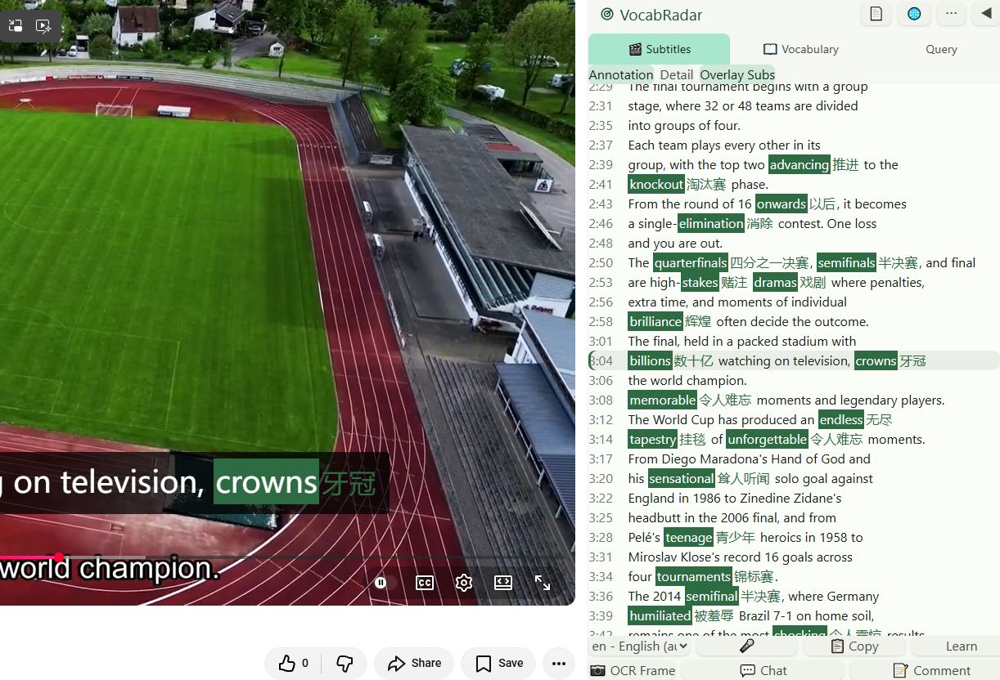
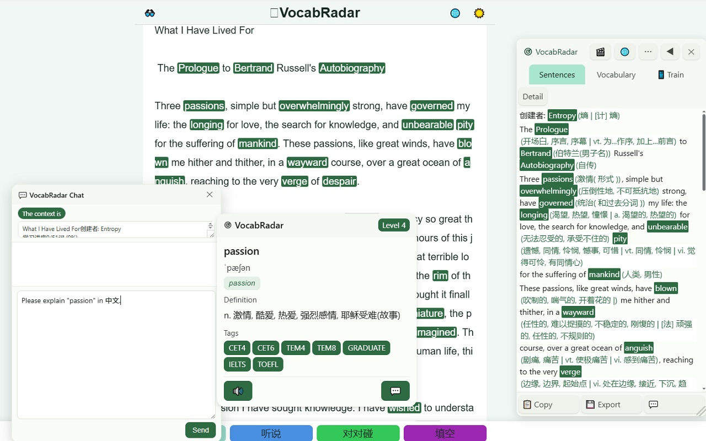

# VocabRadar 词汇雷达

发现并学习视频与网页中的生词。

**[English](README.md) | [简体中文](README-zh.md) | [Español](README.es.md) | [العربية](README.ar.md) | [Português (BR)](README.pt-BR.md) | [Bahasa Indonesia](README.id.md) | [Français](README.fr.md) | [日本語](README.ja.md) | [Русский](README.ru.md) | [Deutsch](README.de.md)**

配套网站：<https://vocabradar.com>

## 这是啥

VocabRadar 是 Chrome / Edge / Firefox 的浏览器扩展。它扫描你正在看的视频或网页，根据词频判断你可能不认识的词并标注释义。支持 **42 种语言**。免注册、无账号，所有查询在本地进行，浏览记录不上传。

支持的语言（42 种）：

`ar bg bn ca cs da de el en es fa fi fil fr he hi hu id is it ja ko lt lv mk ms nb nl pl pt ro ru sh sk sl sv ta tr uk ur vi zh`

## 能干些啥

- **看视频学词**——B 站 / YouTube 视频页右侧出现学习面板：字幕列表（生词高亮）+ 生词表。字幕也可叠加在视频画面上，带注释。注释可切详略，点击时间戳跳转到对应句子，一键填入评论框或弹幕。
- **逛网页学词**——任意网页正文的生词高亮显示，悬停查看释义，右键可查词；侧栏汇总本页生词与例句。
- **没字幕也能学**——内置本地语音识别（Whisper），无字幕视频、录音、上传的音视频均可转写成可学文本；OCR 识别视频帧文字（硬字幕、幻灯片）。
- **AI 对话**——内置对话窗，可用免费模型或你自己配置的 OpenAI / Anthropic 兼容 Key，结合上下文查词和讨论。
- **配套练习与体验**——把整理的页面和卷轴推送到 [vocabradar.com](https://vocabradar.com)，进行复习与练习。

## 截图

视频提示（字幕+注释） | 网页生词提示
:---:|:---:
 | 

## 安装

| 浏览器 | 方法 |
|---|---|
| **Firefox** | [addons.mozilla.org — VocabRadar](https://addons.mozilla.org/zh-CN/firefox/addon/vocabradar/) |
| **Edge** | [Microsoft Edge 加载项 — VocabRadar](https://microsoftedge.microsoft.com/addons/detail/hcpmjphbnjhlfahimifbkhfjafkfjbbb) |
| **Chrome** | 尚未上架商店。请到仓库 Releases 页面（`<repo-url>/releases`）下载最新 zip，解压后打开 `chrome://extensions`，开启**开发者模式**，点击**加载已解压的扩展程序**，选择解压出的文件夹。官方指南：[加载已解压的扩展程序](https://developer.chrome.com/docs/extensions/get-started/tutorial/hello-world?load-unpacked)。 |

## 微信小程序

想在手机上练习？用微信扫描下方二维码，打开「河狸记词」小程序：

## 数据来源

- **词频数据**——来自 Hugging Face 数据集
  [`vocabradar/wordfreq`](https://huggingface.co/datasets/vocabradar/wordfreq)：上述 42 种语言的清洗词频表，源自 [wordfreq](https://github.com/rspeer/wordfreq) 3.0.2（MIT）。扩展按需下载你所学的语言，使用前校验完整性（SHA-256）。
- **英文词表与释义**——随扩展本地打包。
- **翻译**——在线渠道、Chrome 内置 Translator API 或你自己配置的 AI 接口；每次只发送你主动查询的文本。

## Roadmap / TODO

- **生词本（wordbook）**——多设备同步、间隔重复复习，与配套网站练习联动。
- 更多视频站点（B 站 / YouTube 之外）。
- 更多随包词表与释义。

## 隐私

无账号、无数据收集、无追踪。一切都在你的设备上。详见 [PRIVACY.md](PRIVACY.md)（中英双语）。

## 仓库 / 许可证

- 仓库地址：*待填——占位，填入公开仓库 URL（其 Releases 页面用于提供 Chrome 安装包）。*
- 许可证：*待填——占位。*
- 构建与 AMO 源码披露说明：[doc/build-readme.md](doc/build-readme.md)。